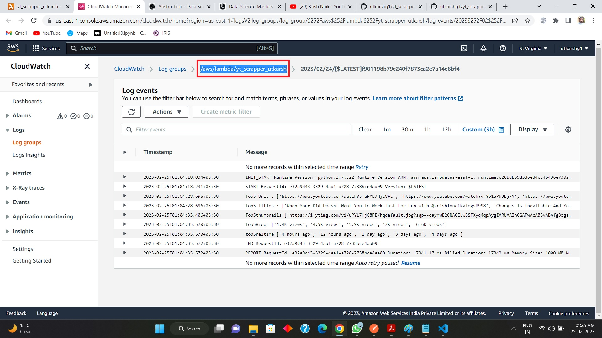

# This is code for AWS Lambda API - Utkarsh Gaikwad

### I created a post request API which is connected to AWS Lambda named : yt_scrapper_utkarsh
### API Link : [https://8rkvysfczg.execute-api.us-east-1.amazonaws.com/yt_scrapper_utkarsh](https://8rkvysfczg.execute-api.us-east-1.amazonaws.com/yt_scrapper_utkarsh)

# Link To the code inside AWS Lambda function in this repository 
## Code Inside AWS Lambda : [ytApi.py](ytApi.py)

# Link To Jupyter Notebook using this api 
## Link for How to use my API : [APIusage.ipynb](APIusage.ipynb)

# Link for my detailed Logic in this Notebook 
## Link for my Complete logic behind this code : [Logic Jupyter Notebook for Code](https://github.com/utkarshg1/PWSkills-Assignments/blob/main/Assignment%2021%20-%2022%20February%202023/Assignment21Utkarsh.ipynb)

# This API serves my Elastic Beanstalk Webpage 
## My Final Web App link : [http://utkarshgaikwadytscraping-env.eba-gm3aqm5x.us-east-1.elasticbeanstalk.com/)](http://utkarshgaikwadytscraping-env.eba-gm3aqm5x.us-east-1.elasticbeanstalk.com/)

# YouTube Demo for my Elastic Beanstalk Web Application 
## YouTube Demo : [https://youtu.be/X-7ZvUQZiYQ](https://youtu.be/X-7ZvUQZiYQ)

# GitHub Repository for my Elastic Beanstalk 
## GitHub for my Final App : [https://github.com/utkarshg1/yt_scrapper_aws_utkarsh](https://github.com/utkarshg1/yt_scrapper_aws_utkarsh)

# How to use this api from python

```python
import requests
data = {'url':'https://www.youtube.com/@PW-Foundation/videos'}
my_api_url = 'https://8rkvysfczg.execute-api.us-east-1.amazonaws.com/yt_scrapper_utkarsh'
response = requests.post(my_api_url,json=data)
response.json()
```

# Below is screenshot of successful deploymnet on AWS Lambda


# Below is my https api screenshot for post request resource


# Validation with postman screenshot


# Response generated by API

```json
{
    "url_provided": "https://www.youtube.com/@PW-Foundation/videos",
    "channel_title": "Physics Wallah Foundation - YouTube",
    "output": {
        "title": [
            "How to Attempt English Board Exam ????",
            "Best technique to attempt SST paper in Board exam || Class 10th",
            "Last Minute Strategy To Score More Than 98% || ICSE Boards || Class-10th",
            "Why You Should Choose Commerce After 10th? || Complete Information💯",
            "Follow This Plan To Score More Than 95% in Boards || Topper's Strategy"
        ],
        "reltime": [
            "1 day ago",
            "2 days ago",
            "3 days ago",
            "4 days ago",
            "9 days ago"
        ],
        "views": [
            "116K views",
            "54K views",
            "22K views",
            "28K views",
            "312K views"
        ],
        "videoURL": [
            "https://www.youtube.com/watch?v=nX5ONgCdLcc",
            "https://www.youtube.com/watch?v=AM2Dt7cNebw",
            "https://www.youtube.com/watch?v=7nMJVhey9TM",
            "https://www.youtube.com/watch?v=FSVVlcFUCMk",
            "https://www.youtube.com/watch?v=vKxdTuOirnI"
        ],
        "thumbnailURL": [
            "https://i.ytimg.com/vi/nX5ONgCdLcc/hqdefault.jpg?sqp=-oaymwEcCNACELwBSFXyq4qpAw4IARUAAIhCGAFwAcABBg==&rs=AOn4CLBaa_KLfKyYbUYRsb5xf0YCp1YrlQ",
            "https://i.ytimg.com/vi/AM2Dt7cNebw/hqdefault.jpg?sqp=-oaymwEcCNACELwBSFXyq4qpAw4IARUAAIhCGAFwAcABBg==&rs=AOn4CLBJHWHabeJ94dcUDlDDNfvQxnUfJg",
            "https://i.ytimg.com/vi/7nMJVhey9TM/hqdefault.jpg?sqp=-oaymwEcCNACELwBSFXyq4qpAw4IARUAAIhCGAFwAcABBg==&rs=AOn4CLDHikOj7gH4eQNudv7c1qNbwcMWyA",
            "https://i.ytimg.com/vi/FSVVlcFUCMk/hqdefault.jpg?sqp=-oaymwEcCNACELwBSFXyq4qpAw4IARUAAIhCGAFwAcABBg==&rs=AOn4CLAadJS9mLtZptLHtKHEefPgqk3NCg",
            "https://i.ytimg.com/vi/vKxdTuOirnI/hqdefault.jpg?sqp=-oaymwEcCNACELwBSFXyq4qpAw4IARUAAIhCGAFwAcABBg==&rs=AOn4CLBonfyIr0oe5WzFo2o2hoU5Yxbv8w"
        ]
    }
}
```
# Logs Inside my AWS Console for Lambda Function



# Reference YouTube Video 


### YouTube Link : [https://youtu.be/b49Y3NGJX68](https://youtu.be/b49Y3NGJX68)
